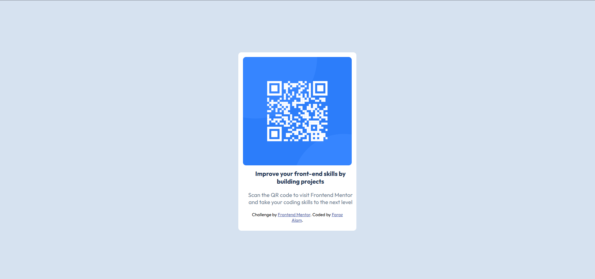
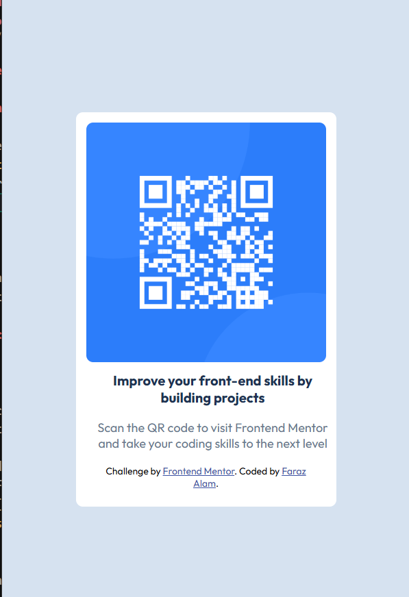

# Frontend Mentor - QR code component solution

This is a solution to the [QR code component challenge on Frontend Mentor](https://www.frontendmentor.io/challenges/qr-code-component-iux_sIO_H). Frontend Mentor challenges help you improve your coding skills by building realistic projects.

## Table of contents

- [Overview](#overview)
  - [Screenshot](#screenshot)
  - [Links](#links)
- [My process](#my-process)
  - [Built with](#built-with)
  - [What I learned](#what-i-learned)
  - [Continued development](#continued-development)
  - [Useful resources](#useful-resources)
- [Author](#author)
- [Acknowledgments](#acknowledgments)

## Overview

### Screenshot

Desktop Version

Mobile Version


### Links

- Solution URL: [Repo](https://github.com/farazalam2017/QR-code-component-frontendmentor)
- Live Site URL: [Live](https://qr-code-component-farazalam2017.netlify.app/)

## My process

### Built with

- Semantic HTML5 markup
- CSS custom properties
- Flexbox

### What I learned

Since i amy attempting to attempt these challenges quite few time but fail everytime but now finally i have completed one challenge. Code snippet which are helpful are:-

```html
<h3>Hero of my html page</h3>
```

```css
.proud-of-this-css {
  display: flex;
  justify-content: center;
  align-items: center;
  height: 100vh;
  margin: auto;
}
```

### Continued development

In this project in past few years for the first time i was able to make something using given guide and files without any tutorial help. Just using technique from my past learning. I am not comfortable in positioning elements in my web page however will write all those spells 🪄🪄🪄🔮 to make my projects in future projects.

-

### Useful resources

- [Google](https://www.google.com) - This is the OG for those fancy tutorial on you tube. If get stuck somewhere just google things up and try to get your desired one by searching things and reading a lot don't get overwhelmed and frustrated, it is part of learning 🏫

## Author

- Website - [Faraz Alam](https://github.com/farazalam2017)
- Frontend Mentor - [farazalam2017](https://www.frontendmentor.io/profile/farazalam2017)
- Linked In - [farazalam2017](https://www.linkedin.com/in/farazalam2017/)

## Acknowledgments

First and foremost, I thank Allah, who has blessed me with a good life, wonderful parents, and a supportive environment to learn and grow through all the ups and downs of life.
Remember, all of us are destined to leave this world one day. Before that day comes, strive to do something meaningful — something that makes those who remain proud and benefits humanity. Let the tree you plant bear sweet fruits for others, and may you be remembered with a smiling face in the hereafter.
A special thanks to the person who created such a wonderful platform for helping us practice and improve ourselves.
